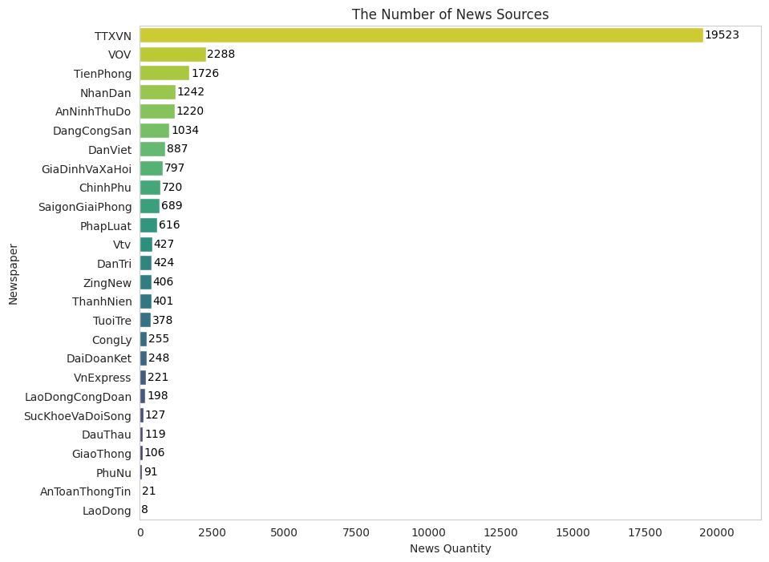
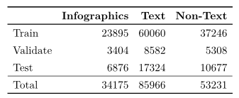
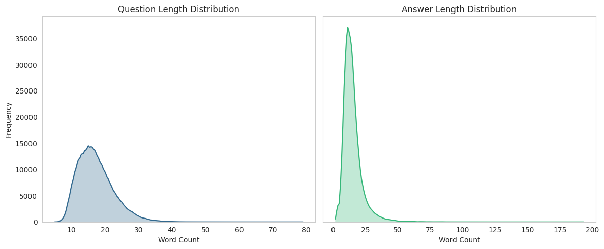
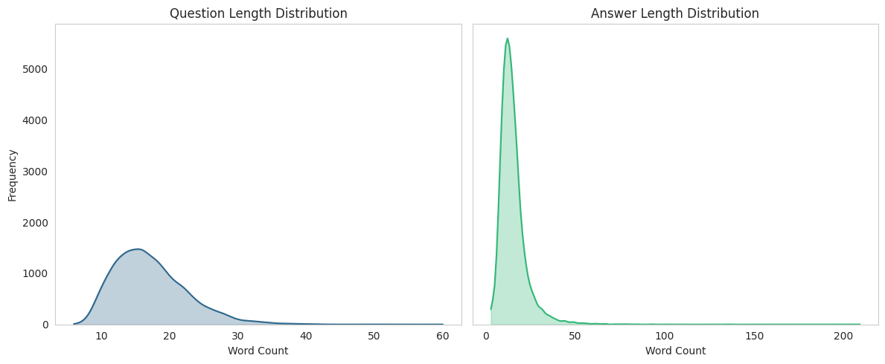
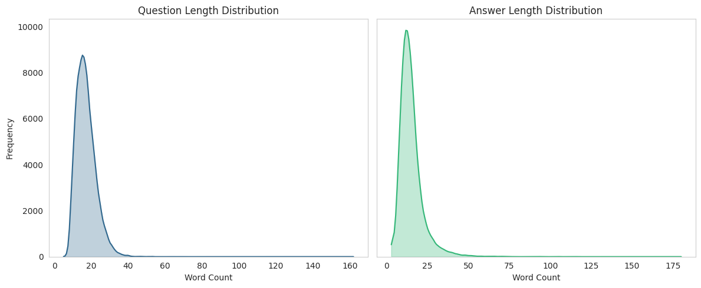
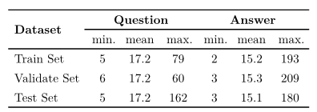

# 📊 Initial Dataset Statistics
As the first step in analyzing the **ViInfographicsVQA** dataset, we provide a series of preliminary statistics to better understand its structure, scale, and design choices. These statistics serve as a foundation for further processing, filtering, and modeling.

## 1.📰 Number of Infographics per News Agency
Given that our dataset was built by crawling Infographics from **multiple Vietnamese news outlets**, it is important to present the number of Infographics collected from each source. This information:

+ Reflects the **scale and distribution** of our data collection.

+ Highlights the diversity and representativeness of the sources.

This breakdown is useful for identifying data imbalances or biases across different publishers.

    
    
Figure 1: The number of Infographics crawled from each News Outlet

## 2.🧠 Number of Text and Non-Text Questions per Split (Train / Validation / Test)
Our dataset was **intentionally designed** to include two distinct types of questions:

+ **Text-based questions**: Focus on information extracted from textual or numerical elements within the Infographics.

+ **Non-text questions**: Focus on visual or structural aspects, such as objects, people, colors, and layout.

To support task-specific models and evaluation, we provide detailed statistics on the number of **Text** and **Non-text** questions in each of the three dataset splits: train, val, test. This separation is critical for understanding the nature of the dataset and evaluating performance on different types of reasoning.

    
    
Table 1: Statistics of Infographics and QAs

## 3.📈 Distributions of Question and Answer Lengths
We analyze and visualize the **distribution of question and answer lengths** for each dataset split. These statistics are essential for several reasons:

+ Identifying **outliers** (i.e., extremely short or long samples) that may affect training stability.

+ Helping define **truncation or padding thresholds** during preprocessing.

+ Ensuring consistency in the **linguistic complexity** across different splits.

These distributions support informed decisions for filtering, normalizing, or refining the dataset before model training.

    
    
Figure 2: The distribution of questions and answers' length in train set

 

    
    
Figure 3: The distribution of questions and answers' length in validation set

 

    
    
Figure 4: The distribution of questions and answers' length in test set

 

    
    
Table 2: Statistic of questions and answers' length

