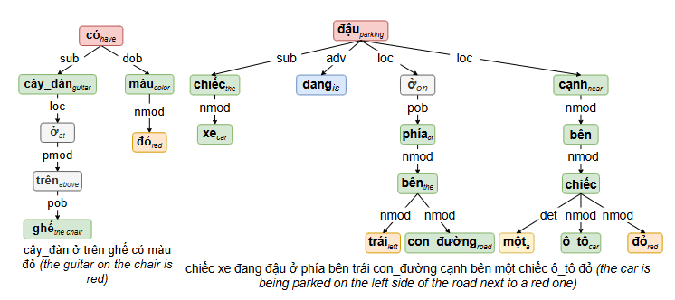
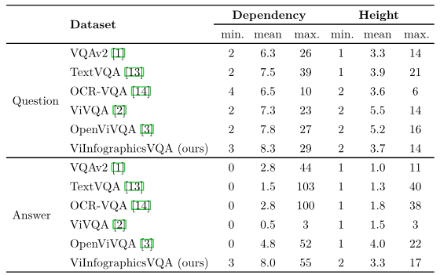

# 📚 Linguistic Complexity Specification (LCS)
In addition to basic dataset statistics, we conducted an **in-depth linguistic analysis** to assess the complexity and diversity of **ViInfographicsVQA** in comparison to other VQA datasets in both **Vietnamese and English**. These include:

+ VQAv2 [[1]](https://arxiv.org/abs/1505.00468)

+ OCR-VQA [[2]](https://anandmishra22.github.io/files/mishra-OCR-VQA.pdf)

+ TextVQA [[3]](https://arxiv.org/abs/1904.08920)

+ ViVQA [[4]](https://aclanthology.org/2021.paclic-1.72.pdf)

+ OpenViVQA [[5]](https://arxiv.org/abs/2305.04183)

## 🧠 What is LCS?

We define the linguistic characteristics of a VQA dataset based on two key factors:

+ The **number of semantic dependencies** within each question or answer.

+ The **height of the corresponding semantic dependency tree**.

These two metrics reflect how **syntactically and semantically complex** a sentence is. To quantify these aspects, we adopted the **Linguistic Complexity Specification (LCS)** algorithm from OpenViVQA [[5]](https://arxiv.org/abs/2305.04183).

LCS works as follows:

1. A **dependency parser** suited to the language of the input sentence is used to extract **syntactic dependencies** between tokens.

2. A **semantic dependency tree** is constructed from these relationships.

3. The **number of dependencies** and **tree height** are measured.

    + More dependencies → Higher syntactic richness

    + Taller tree → Greater structural complexity

<div align="center" style="text-align: center;">
    
</div>
<div style="text-align: left; font-style: italic;">
    Figure 1: Trees of semantic dependencies between a simple sentence (left) and a complicated sentence (right). The simple sentence has 6 dependencies and its semantic tree has a height of 4 while the complicated one has 14 dependencies and its semantic tree has a height of 4. <a href="https://arxiv.org/abs/2305.04183">[5]</a>
</div>

## 📝 Preprocessing and Parsing for Vietnamese

Before applying the LCS algorithm, we preprocess all questions and answers to ensure **accurate linguistic analysis**, especially in **Vietnamese**, which uses **multi-syllabic compound words**. For example:

+ “học sinh” (student)

+ “đại học” (university)

Without proper segmentation, “học sinh” may be split into “học” and “sinh”, leading to misinterpretations like “studying biology”.

✅ **Preprocessing steps for Vietnamese**:

+ **Word Segmentation**: Performed using **VNCoreNLP** [[6]](https://aclanthology.org/N18-5012/).

+ **Dependency Parsing**: Conducted using **PhoNLP** [[7]](https://arxiv.org/abs/2101.01476).

## 🛠 Installation Instructions for PhoNLP and VNCoreNLP

### 1. Install Java (Required for VNCoreNLP)

+ Download Java and find the path to the `bin` directory, e.g.: `C:\Program Files\Java\jre1.8.0_441`

+ Set a system environment variable:

    + Name: `JAVA_HOME`

    + Value: the path above (without `\bin`)

### 2. Install Python Packages

```bash
pip install phonlp
pip install py_vncorenlp
```

### 3. Install PhoNLP Model

1. Locate the folder where the `phonlp` package was installed. For example: `C:\Users\<YourUsername>\AppData\Roaming\Python\Python311\site-packages\phonlp`

2. Navigate to that directory and run:

```bash
python run_script.py
```

This will automatically download the model file: `phonlp.pt`

You can now load PhoNLP in your code for dependency parsing.

### 4. Install VNCoreNLP Model

1. Clone the official repository: 

```bash
https://github.com/vncorenlp/VnCoreNLP
```

2. Ensure the directory you're using contains the file: `VnCoreNLP-1.2.jar`

3. Update your script to point to this directory when loading VNCoreNLP.

<div align="center" style="text-align: center;">
    
</div>
<div style="text-align: left; font-style: italic;">
    Table 1: Linguistic comparison on questions and answers among VQA datasets. Note that these results were obtained on train-dev sets. <a href="https://arxiv.org/abs/2305.04183">[5]</a>
</div>