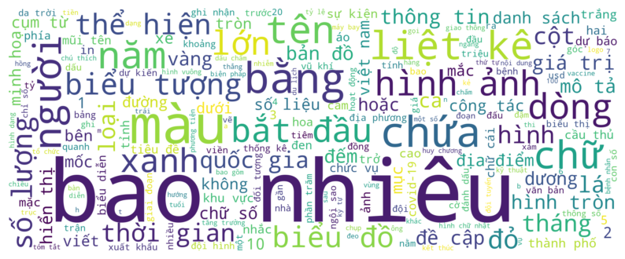
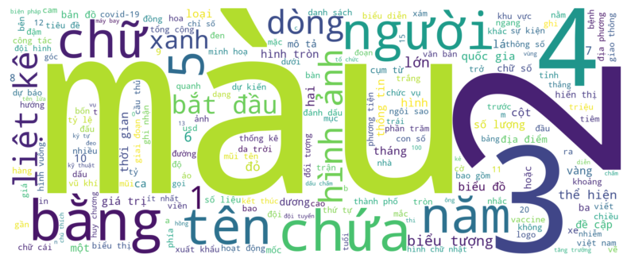

# 🔤 Vocabulary Construction

To prepare vocabulary sets for both **questions** and **answers**, we constructed two separate vocabularies using a **four-step preprocessing pipeline** tailored specifically for **Vietnamese**. This process ensures linguistic consistency, semantic accuracy, and task relevance.

## 🧹 Preprocessing Pipeline

1. **Lowercasing**

All question and answer texts were converted to **lowercase** to ensure consistency in token comparison and reduce vocabulary redundancy (e.g., “Covid” vs. “covid”).

2. **Word Segmentation using VNCoreNLP**

Vietnamese is a language with many **multi-syllabic compound words**. For example:

+ “học sinh” (student)

+ “đại học” (university)

Without correct segmentation, these may be incorrectly interpreted as two separate and unrelated words. We used **VNCoreNLP**  to perform accurate **word segmentation**, preserving the semantic meaning of tokens.

3. **Symbol Filtering**

We removed all **non-alphanumeric characters**, with the exception of symbols that **carry meaningful information** in the context of infographics:

- **Commas** `,`: used in large numbers (e.g., “1,000,000”)

- **Percentage signs** `%`

- **Units and special characters** commonly found in data charts and statistics

4. **Stopword Removal with Custom Filtering**

We used a Vietnamese stopword list from this [repository](https://github.com/stopwords/vietnamese-stopwords). However, instead of applying it directly, we **manually curated** this list by:

- **Retaining** domain-relevant words that are generally considered stopwords but are important in infographic contexts (e.g., “bao nhiêu”, “nào”, “một số”)

- **Removing** truly semantically neutral or irrelevant terms

This helps ensure that the resulting vocabulary retains **domain-specific richness** while avoiding unnecessary noise.

## 🔖 Special Tokens

To build a complete and usable vocabulary for downstream tasks like sequence modeling and generation, we added the following **special tokens**:

+ `<PAD>` – **Padding token** used to make all sequences the same length during batching.

+ `<UNK>` – **Unknown token** used for words not present in the vocabulary.

+ `<SOS>` – **Start of sequence**, indicating the beginning of a sentence during generation.

+ `<EOS>` – **End of sequence**, marking the end of a sentence.

These tokens are crucial for building **robust models**, especially when using techniques like sequence-to-sequence learning or transformers.

## ☁️ Visualizing Vocabulary with WordCloud

To **illustrate the diversity** and **semantic richness** of the constructed vocabulary, we used **WordCloud** visualizations. These visualizations:

- Highlight the **most frequent words** across the dataset.

- Help identify **dominant themes or entities** present in questions and answers.

- Provide **intuitive insight** into dataset content, useful for exploratory data analysis and debugging vocabulary quality.

    
    
Figure 1: Wordcloud of questions' vocabulary set

    
    
Figure 2: Wordcloud of answers' vocabulary set

