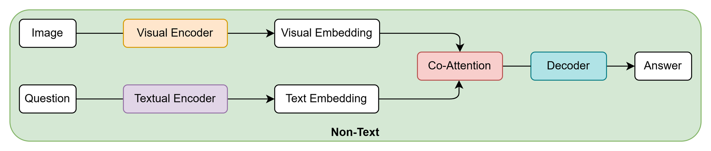
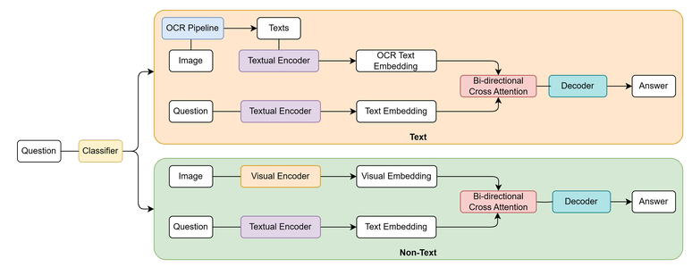

# 🏋️‍♂️ Model Training Approaches

We propose two approaches to train Visual Question Answering (VQA) models on the **ViInfographicsVQA dataset**. Given:

+ An **infographic image** $I$

+ A **natural language question** $Q$

The goal is to generate a correct answer $A$ by reasoning over both **visual elements** and **embedded text** within the image.

## 📷 Approach 1: Visual-Only Processing

> A lightweight baseline that ignores embedded text and focuses solely on the image.

**Pipeline Overview**:

- 🖼️ **Input**: Image $I$ and Question $Q$

- 🧠 **Visual Encoder**: Extracts **visual embeddings** from the image

- 📝 **Textual Encoder**: Encodes the question into **text embeddings**

- 🔄 **Bi-directional Cross Attention**: Learns cross-modal alignments between visual and text embeddings

- 🗣️ **Decoder**: Generates the final answer $A$

**Architecture Flow**

    
    
Figure 1: Diagram of a Non-Text-Based Visual Question Answering approach

## 🔀 Approach 2: Multimodal Text–Visual Fusion

> A more advanced model that dynamically decides whether to use **textual OCR** information in addition to visual cues.

**Pipeline Overview**:

- 🧠 **Classifier**: Predicts if the question requires text-based or non-text-based reasoning.

- 🔸 **Text-based branch** (for text-reliant questions):

    - 🖼️ **OCR Pipeline**: Extracts text from the image using EasyOCR

    - 📚 **Textual Encoder**: Encodes the OCR texts into **OCR text embeddings** as well as cncodes the question into **text embeddings**

    - 🔄 **Bi-directional Cross Attention**: Merges OCR + question embeddings

    - 🗣️ **Decoder**: Generates the final answer $A$

- 🔹 **Non-text branch** (same as Approach 1):

    - 🧠 Uses **Visual Encoder**, **Textual Encoder**, **Co-Attention**, and **Decoder** (no OCR needed)

**Architecture Flow**

    
    
Figure 2: Diagram of Text-Based and Non-Text-Based Visual Question Answering approach

## 📝 **Note**:

The **OCR phase** should be executed **before training**, using:

- **EasyOCR** to extract text snippets from infographics

- **Gemini API** to summarize or refine the raw OCR output into usable structured text

Due to Gemini API rate limits, we **run OCR + Gemini** offline and store results for model training later.